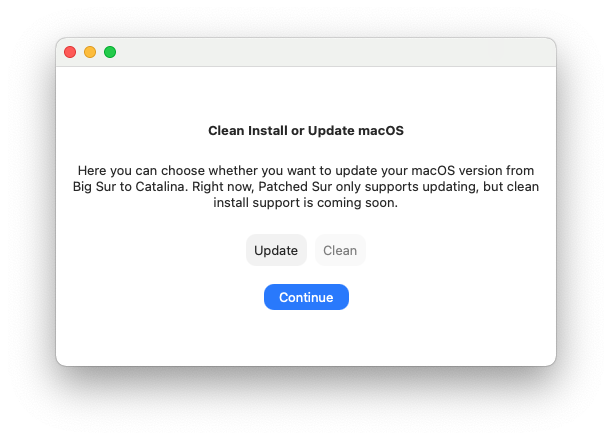

# Install Method

This install method you choose defines whether or not you want to reset macOS back to its defualt state, without keeping your data, or just update the OS version to a newer macOS version. A clean install completely wipes your drive, then reinstalls macOS so you can run the setup process again. An updates just updates macOS to the lastest version.

