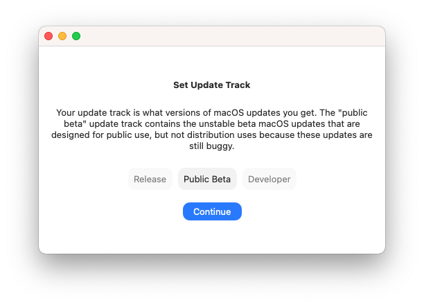

# Update Tracks

Update tracks are what kind of macOS versions you want to get in each update.  For example, one track could be the stable/release track and other might be the unstable/beta track. Normally, you are on the release update track, but you can change that in stock macOS by downloading a configuration profile that changes this for you. However, since you are on an unsupported Mac, you can't use System Preferences to update, so you have to choose your track in here and Patched Sur will automatically grab the correct macOS version for you. MacOS has three different update tracks available: release, public beta, and developer beta. 

### Release Track

The release track is the defualt and most stable update track. This track contains the macOS updates you would get normally if you were on a supported Mac and did not install a configuration profile to change it. More likely than not, this is the track you want to be on.

### Public Beta Track

The public beta track is the beta that's stable enough for some of the public to use it, but not stable enough for distribution yet. It still has bugs and problems, so it is considered a beta track.

### Developer Beta Track

The developer beta track is the beta designed for developers so they can prepare their apps to use the latest features of macOS for their users. This track is the most unstable of all, but that doesn't mean it can't be stable at times.

